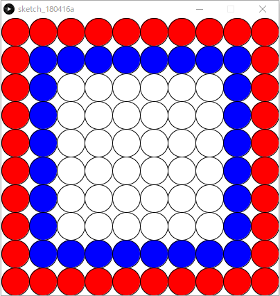

# ColorCircle
- エリア内に円をしきつめ，指定位置の色を変えるプログラム
- **Processingのみ**

## ルール
- 400x400のウィンドウに縦10個，横10個円を敷き詰める
- 一番端は赤色
- 端から2番目は赤色
- その他は白色とする
- できれば20行以内で書く

## 必要知識
- `if/else`
- `多重for`
- `or演算子`

## 出力例
